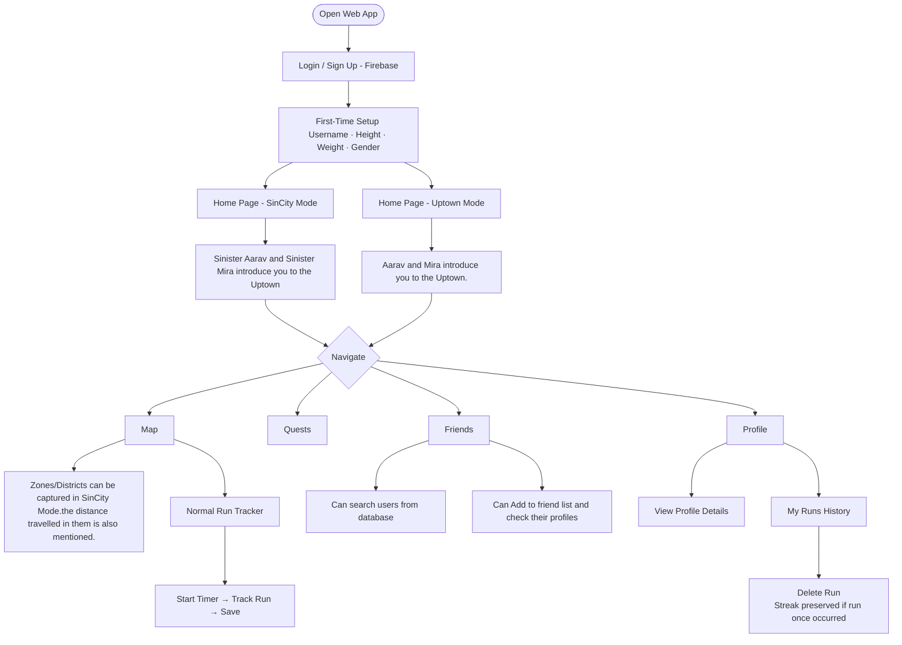
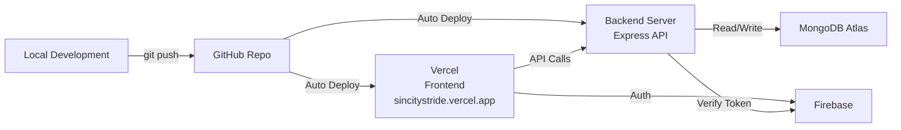

# SinCity Stride

> *"Movement means control. Distance means power."*

**SinCity Stride** is a gamified fitness web application that transforms your running journey into an immersive RPG(Role-Playing Game) style experience. Complete quests, capture map regions, level up, and challenge friends — all while hitting real-world fitness goals.

---

##  Table of Contents

- [Overview](#-overview)
- [Tech Stack](#-tech-stack)
- [Features](#-features)
- [App Flow](#-app-flow)
- [Quest System](#-quest-system)
- [Project Structure](#-project-structure)
- [Environment Variables](#-environment-variables)
- [Deployment](#-deployment)

---

##  Overview

Many users struggle with consistency during their fitness journey. **SinCity Stride** solves this by transforming fitness tracking into a game — complete missions, level up, capture regions, and battle friends in a dual-world narrative experience.

The app features two distinct modes:

| Mode | Theme | Characters |
|------|-------|------------|
|  **Uptown Mode** | Clean, motivating, everyday fitness | Aarav & Mira (casual) |
|  **SinCity Mode** | Dark, intense, tactical conquest | Aarav & Mira (badass) |

---

##  Tech Stack

```mermaid
graph TD
  A[Frontend - React + Tailwind CSS]
  B[Backend - Node.js + Express]
  C[Database - MongoDB Mongoose]
  D[Auth - Firebase Authentication]
  E[Maps - OpenStreetMap]
  F[Hosting - Vercel + Render]

  style A fill:#e3f2fd,stroke:#90caf9,color:#0d47a1
  style B fill:#e8f5e9,stroke:#81c784,color:#1b5e20
  style C fill:#f1f8e9,stroke:#aed581,color:#33691e
  style D fill:#fff8e1,stroke:#ffd54f,color:#ff6f00
  style E fill:#e1f5fe,stroke:#4fc3f7,color:#01579b
  style F fill:#f3e5f5,stroke:#ba68c8,color:#4a148c
```


---

## Features

###  Home Page
- Personalized greeting: *"Hi! username"* (top left)
- Activity Calendar with persistent streak markers
- Can see the running logs of any day from 1960 to 2060
- SinCity / Uptown mode toggle (top right)

###  Map
- Live GPS route tracking during runs
- Play / Pause run timer
- Run data saved to MongoDB
- Zoom controls (bottom-left, non-obstructing)
- **SinCity Mode:** Stranger man's photo added in the map for the special quest

###  Quests
- 10 quests provided for the Uptown mode
- XP count
- Completed tasks indicator
- SinCity Quests (7 total in SinCity)
- Special locked Quest #7 (unlocked after visiting SinCity map)

###  Friends
- View friends' profiles (username, photo, level, streak, best pace)
- Add friends via `Add` button

###  Profile
- Name, email, height, weight, gender, profile photo
- All-time records: Longest Run · Best Pace · Regions Captured
- Total XP (Uptown + SinCity combined)
- "My Runs" history with delete option

### Story Mode 
- Cinematic dialogue sequences with Aarav, Mira & The Stranger
- Skip option available at every dialogue block
- Each animation plays only **once per user account**
- Persistent per-user state stored in MongoDB
### Music
- We have added music in the game to make it more fun to play.


---

##  App Flow



---
---

## 📁 Project Structure

```
sincity-stride/
├── flow-app/
│   ├── backend/
│   │   ├── config/
│   │   │   └── db.js
│   │   ├── middleware/
│   │   │   └── authMiddleware.js
│   │   ├── models/
│   │   │   ├── ActivityLog.js
│   │   │   ├── District.js
│   │   │   ├── FriendRequest.js
│   │   │   ├── Quest.js
│   │   │   ├── Region.js
│   │   │   ├── Run.js
│   │   │   ├── User.js
│   │   │   └── UserQuest.js
│   │   ├── routes/
│   │   │   ├── authRoutes.js
│   │   │   ├── districtRoutes.js
│   │   │   ├── friendRoutes.js
│   │   │   ├── questRoutes.js
│   │   │   ├── runRoutes.js
│   │   │   ├── storyRoutes.js
│   │   │   └── userRoutes.js
│   │   ├── utils/
│   │   │   ├── districtDetector.js
│   │   │   └── levelUtils.js
│   │   ├── node_modules/
│   │   ├── package-lock.json
│   │   ├── package.json
│   │   └── server.js
│   ├── frontend/
│   │   ├── public/
│   │   │   ├── favicon.svg
│   │   │   └── icons.svg
│   │   ├── src/
│   │   │   ├── assets/
│   │   │   │   ├── 1.mp3
│   │   │   │   ├── 2.mp3
│   │   │   │   ├── AaravS.svg
│   │   │   │   ├── AaravU.svg
│   │   │   │   ├── loc.svg
│   │   │   │   ├── loc2.svg
│   │   │   │   ├── logo.svg
│   │   │   │   ├── logo2.svg
│   │   │   │   ├── man.svg
│   │   │   │   ├── MiraS.svg
│   │   │   │   ├── MiraU.svg
│   │   │   │   └── Stranger.svg
│   │   │   ├── components/
│   │   │   │   ├── BackgroundMusic.jsx
│   │   │   │   ├── BottomNav.jsx
│   │   │   │   ├── Characterguide.jsx
│   │   │   │   ├── LoadingSpinner.jsx
│   │   │   │   ├── SinModeToggle.jsx
│   │   │   │   ├── StoryOverlay.jsx
│   │   │   │   └── ThemeToggle.jsx
│   │   │   ├── context/
│   │   │   │   ├── AuthContext.jsx
│   │   │   │   ├── StoryContext.jsx
│   │   │   │   └── ThemeContext.jsx
│   │   │   ├── data/
│   │   │   │   └── storyScripts.js
│   │   │   ├── hooks/
│   │   │   │   └── useRunTracker.js
│   │   │   ├── pages/
│   │   │   │   ├── FriendsPage.jsx
│   │   │   │   ├── HomePage.jsx
│   │   │   │   ├── LoginPage.jsx
│   │   │   │   ├── MapPage.jsx
│   │   │   │   ├── OnboardingPage.jsx
│   │   │   │   ├── ProfilePage.jsx
│   │   │   │   └── QuestPage.jsx
│   │   │   ├── services/
│   │   │   │   ├── api.js
│   │   │   │   └── firebase.js
│   │   │   ├── utils/
│   │   │   │   ├── fixLeafletIcons.js
│   │   │   │   └── level.js
│   │   │   ├── App.jsx
│   │   │   ├── index.css
│   │   │   └── main.jsx
│   │   ├── eslint.config.js
│   │   ├── index.html
│   │   ├── package-lock.json
│   │   ├── package.json
│   │   ├── postcss.config.js
│   │   ├── tailwind.config.js
│   │   ├── vercel.json
│   │   └── vite.config.js
│   ├── package-lock.json
│   └── package.json
└── README.md
---
```
## 🔑 Environment Variables

### Backend (`/backend/.env`)

```env

PORT=5000
MONGO_URI=mongodb+srv://<username>:<password>@cluster0.qbigyod.mongodb.net/?appName=Cluster0
FIREBASE_PROJECT_ID=our_firebase_project_id
```

### Frontend (`/frontend/.env`)

```env


VITE_FIREBASE_API_KEY=your_api_key
VITE_FIREBASE_AUTH_DOMAIN=your_project.firebaseapp.com
VITE_FIREBASE_PROJECT_ID=your_project_id
VITE_FIREBASE_APP_ID=ID
VITE_BACKEND_URL=your_render_link 
```

> ⚠️ **Never commit `.env` files to version control.** They are listed in `.gitignore`.

---

## 🌐 Deployment



- **Frontend:** Deployed on [Vercel](https://vercel.com) at `sincitystride.vercel.app`
- **Backend:** Express server deployed separately on Render at `https://sin-city-stride.onrender.com`
- **Database:** MongoDB Atlas (cloud-hosted)
- **Auth:** Firebase Authentication

---

## 🎭 Characters

| Character | Mode | SVG File | Role |
|-----------|------|----------|------|
| Aarav (Uptown) | Normal | `AaravU.svg` | Guide & Motivator |
| Mira (Uptown) | Normal | `MiraU.svg` | Guide & Motivator |
| Aarav (SinCity) | SinCity | `AaravS.svg` | Tactical Commander |
| Mira (SinCity) | SinCity | `MiraS.svg` | Tactical Commander |
| The Stranger | SinCity | `Stranger.svg` | Special Quest NPC |

> Each character dialogue sequence plays **only once per user account** and can be skipped at any time.

---

## 👤 Author

**Manvik Kumar Gupta**

- GitHub: [@manvik0730v](https://github.com/manvik0730v)

**Aryan Thumula**

- GitHub: [@aryancapy-17](https://github.com/aryancapy-17)

---

- Project: [SinCity Stride](https://github.com/manvik0730v/hacknite)

---

## 📄 License

This project was built for a Hackathon. All rights reserved © Manvik Kumar Gupta.

---

> *"You weren't supposed to find it this early. But I guess you're not like the others."* — Mira
