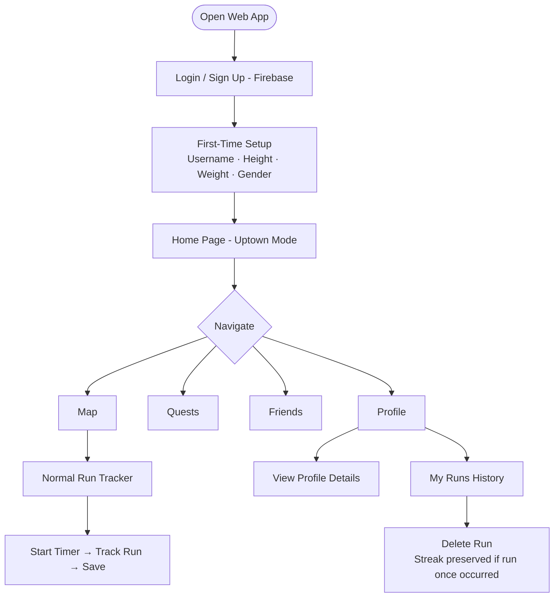
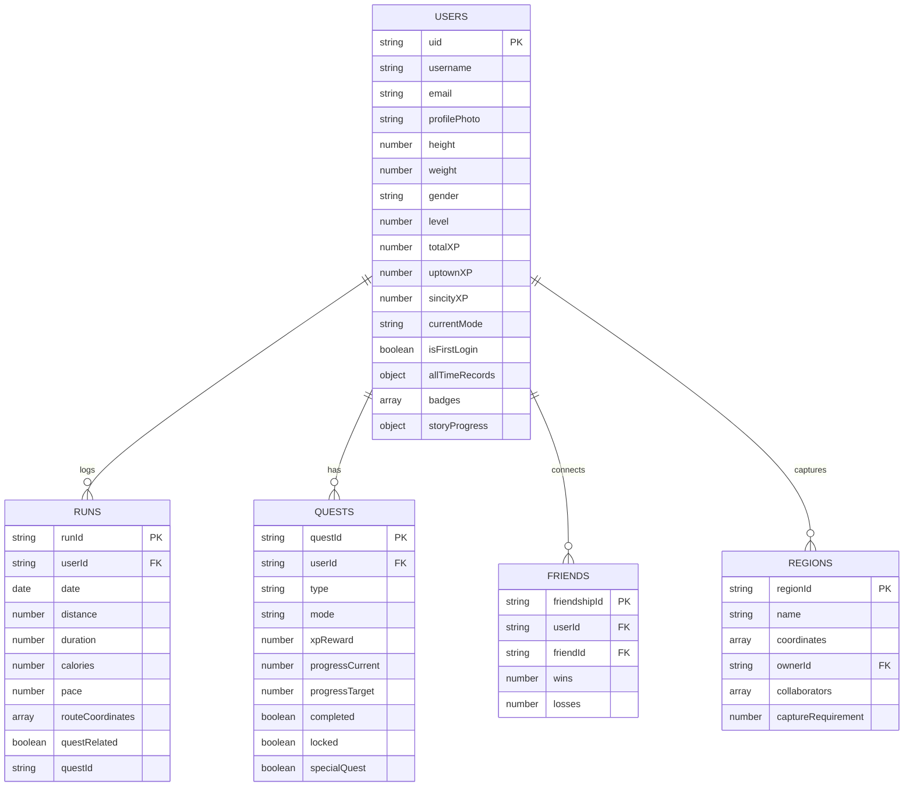
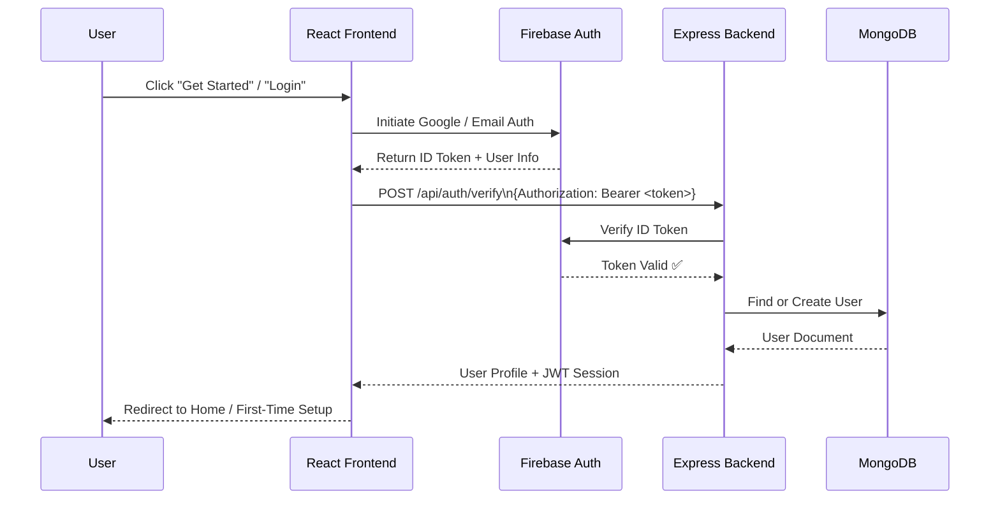
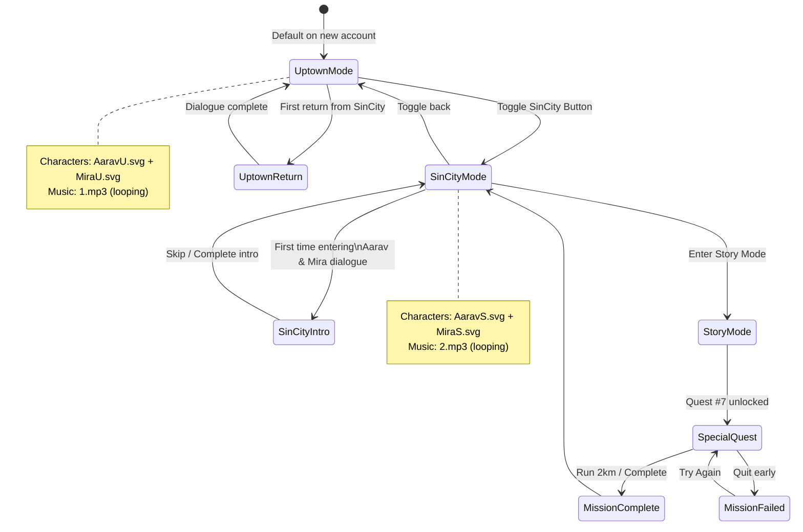
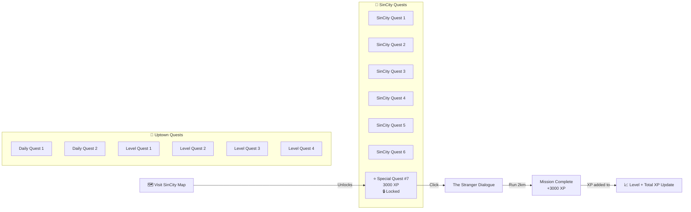
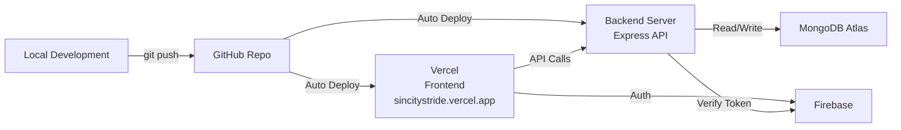

# SinCity Stride

> *"Movement means control. Distance means power."*

**SinCity Stride** is a gamified fitness web application that transforms your running journey into an immersive RPG(Role-Playing Game) style experience. Complete quests, capture map regions, level up, and challenge friends — all while hitting real-world fitness goals.

---

##  Table of Contents

- [Overview](#-overview)
- [Tech Stack](#-tech-stack)
- [Features](#-features)
- [App Flow](#-app-flow)
- [Database Schema](#-database-schema)
- [Authentication Flow](#-authentication-flow)
- [Game Modes](#-game-modes)
- [Quest System](#-quest-system)
- [Project Structure](#-project-structure)
- [Getting Started](#-getting-started)
- [Environment Variables](#-environment-variables)
- [Deployment](#-deployment)

---

##  Overview

Many users struggle with consistency during their fitness journey. **SinCity Stride** solves this by transforming fitness tracking into a game — complete missions, level up, capture regions, and battle friends in a dual-world narrative experience.

The app features two distinct modes:

| Mode | Theme | Characters |
|------|-------|------------|
|  **Uptown Mode** | Clean, motivating, everyday fitness | Aarav & Mira (casual) |
|  **SinCity Mode** | Dark, intense, tactical conquest | Aarav & Mira (badass) |

---

##  Tech Stack

```mermaid
graph TD
  A[Frontend - React + Tailwind CSS]
  B[Backend - Node.js + Express]
  C[Database - MongoDB Mongoose]
  D[Auth - Firebase Authentication]
  E[Maps - OpenStreetMap]
  F[Hosting - Vercel + Render]

  style A fill:#e3f2fd,stroke:#90caf9,color:#0d47a1
  style B fill:#e8f5e9,stroke:#81c784,color:#1b5e20
  style C fill:#f1f8e9,stroke:#aed581,color:#33691e
  style D fill:#fff8e1,stroke:#ffd54f,color:#ff6f00
  style E fill:#e1f5fe,stroke:#4fc3f7,color:#01579b
  style F fill:#f3e5f5,stroke:#ba68c8,color:#4a148c
```


---

## Features

###  Home Page
- Personalized greeting: *"Hi! username"* (top left)
- Activity Calendar with persistent streak markers
- Can see the running logs of any day from 1960 to 2060
- SinCity / Uptown mode toggle (top right)

###  Map
- Live GPS route tracking during runs
- Play / Pause run timer
- Run data saved to MongoDB
- Zoom controls (bottom-left, non-obstructing)
- **SinCity Mode:** Stranger man's photo added in the map for the special quest

###  Quests
- 10 quests provided for the Uptown mode
- XP count
- Completed tasks indicator
- SinCity Quests (7 total in SinCity)
- Special locked Quest #7 (unlocked after visiting SinCity map)

###  Friends
- View friends' profiles (username, photo, level, streak, best pace)
- Add friends via `Add` button

###  Profile
- Name, email, height, weight, gender, profile photo
- All-time records: Longest Run · Best Pace · Regions Captured
- Total XP (Uptown + SinCity combined)
- "My Runs" history with delete option

### Story Mode 
- Cinematic dialogue sequences with Aarav, Mira & The Stranger
- Skip option available at every dialogue block
- Each animation plays only **once per user account**
- Persistent per-user state stored in MongoDB

---

##  App Flow



---

##  Database Schema



---

## 🔐 Authentication Flow



---

## 🌃 Game Modes



---

## ⚔️ Quest System



---

## 📁 Project Structure

```
sincity-stride/
├── frontend/                   # React Application
│   ├── public/
│   │   └── assets/
│   │       ├── AaravU.svg      # Uptown Aarav character
│   │       ├── MiraU.svg       # Uptown Mira character
│   │       ├── AaravS.svg      # SinCity Aarav character
│   │       ├── MiraS.svg       # SinCity Mira character
│   │       ├── Stranger.svg    # NPC character
│   │       ├── man.svg         # Map NPC icon
│   │       ├── 1.mp3           # Uptown background music
│   │       └── 2.mp3           # SinCity background music
│   ├── src/
│   │   ├── components/
│   │   │   ├── Navbar/
│   │   │   ├── Characters/     # Aarav, Mira, Stranger dialogue system
│   │   │   ├── QuestCard/
│   │   │   ├── MapTracker/
│   │   │   └── StatsBlock/
│   │   ├── pages/
│   │   │   ├── Login.jsx
│   │   │   ├── Home.jsx
│   │   │   ├── Map.jsx
│   │   │   ├── Quests.jsx
│   │   │   ├── Friends.jsx
│   │   │   └── Profile.jsx
│   │   ├── services/
│   │   │   ├── firebase.js
│   │   │   ├── api.js
│   │   │   └── mapService.js
│   │   ├── context/
│   │   │   ├── AuthContext.jsx
│   │   │   └── ModeContext.jsx
│   │   └── App.jsx
│   ├── .env
│   └── package.json
│
├── backend/                    # Node.js + Express
│   ├── controllers/
│   │   ├── authController.js
│   │   ├── userController.js
│   │   ├── runController.js
│   │   ├── questController.js
│   │   ├── friendController.js
│   │   └── regionController.js
│   ├── models/
│   │   ├── User.js
│   │   ├── Run.js
│   │   ├── Quest.js
│   │   ├── Friend.js
│   │   └── Region.js
│   ├── routes/
│   │   ├── auth.js
│   │   ├── users.js
│   │   ├── runs.js
│   │   ├── quests.js
│   │   ├── friends.js
│   │   └── regions.js
│   ├── middleware/
│   │   └── verifyToken.js      # Firebase token verification
│   ├── .env
│   ├── server.js
│   └── package.json
│
└── README.md
```

---

## 🚀 Getting Started

### Prerequisites

- Node.js ≥ 18.x
- MongoDB Atlas account
- Firebase project (with Auth enabled)
- Maps API key (RapidAPI / OpenStreetMap)

### 1. Clone the Repository

```bash
git clone https://github.com/manvik0730v/hacknite.git
cd hacknite
```

### 2. Setup Backend

```bash
cd backend
npm install
cp .env.example .env
# Fill in your environment variables
npm run dev
```

### 3. Setup Frontend

```bash
cd frontend
npm install
cp .env.example .env
# Fill in your environment variables
npm start
```

### 4. Run Both Simultaneously

```bash
# From root directory (if concurrently is set up)
npm run dev
```

---

## 🔑 Environment Variables

### Backend (`/backend/.env`)

```env
PORT=5000
MONGODB_URI=mongodb+srv://<username>:<password>@cluster0.qbigyod.mongodb.net/?appName=Cluster0
FIREBASE_PROJECT_ID=your_firebase_project_id
FIREBASE_PRIVATE_KEY=your_private_key
FIREBASE_CLIENT_EMAIL=your_client_email
CORS_ORIGIN=https://sincitystride.vercel.app
```

### Frontend (`/frontend/.env`)

```env
REACT_APP_BACKEND_URL=http://localhost:5000
REACT_APP_FIREBASE_API_KEY=your_api_key
REACT_APP_FIREBASE_AUTH_DOMAIN=your_project.firebaseapp.com
REACT_APP_FIREBASE_PROJECT_ID=your_project_id
REACT_APP_MAPS_API_KEY=your_maps_api_key
```

> ⚠️ **Never commit `.env` files to version control.** They are listed in `.gitignore`.

---

## 🌐 Deployment



- **Frontend:** Deployed on [Vercel](https://vercel.com) at `sincitystride.vercel.app`
- **Backend:** Express server deployed separately on Render at `https://sin-city-stride.onrender.com`
- **Database:** MongoDB Atlas (cloud-hosted)
- **Auth:** Firebase Authentication

---

## 🎭 Characters

| Character | Mode | SVG File | Role |
|-----------|------|----------|------|
| Aarav (Uptown) | Normal | `AaravU.svg` | Guide & Motivator |
| Mira (Uptown) | Normal | `MiraU.svg` | Guide & Motivator |
| Aarav (SinCity) | SinCity | `AaravS.svg` | Tactical Commander |
| Mira (SinCity) | SinCity | `MiraS.svg` | Tactical Commander |
| The Stranger | SinCity | `Stranger.svg` | Special Quest NPC |

> Each character dialogue sequence plays **only once per user account** and can be skipped at any time.

---

## 👤 Author

**Manvik Kumar Gupta**

- GitHub: [@manvik0730v](https://github.com/manvik0730v)
- Project: [SinCity Stride](https://github.com/manvik0730v/hacknite)

---

## 📄 License

This project was built for a Hackathon. All rights reserved © Manvik Kumar Gupta.

---

> *"You weren't supposed to find it this early. But I guess you're not like the others."* — Mira
